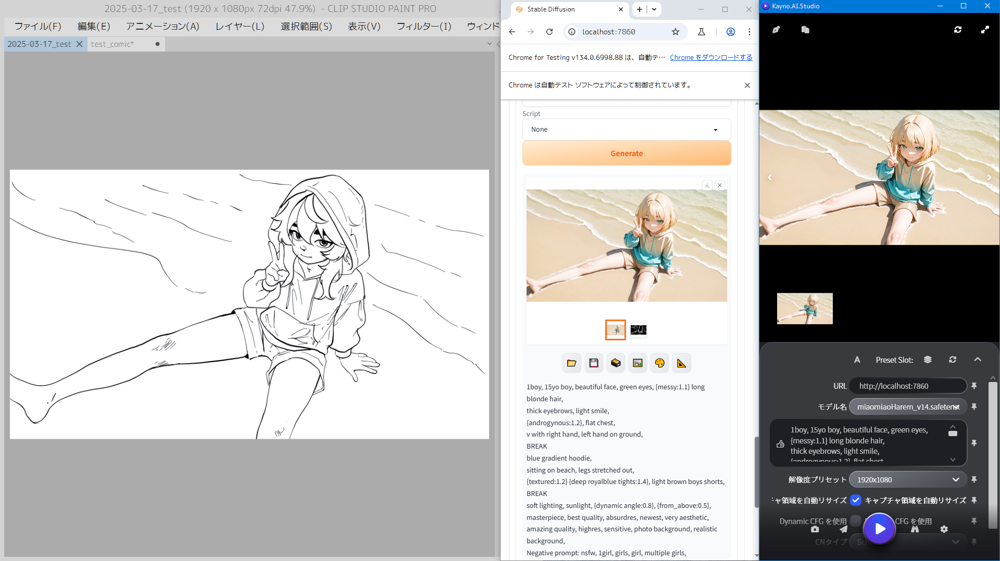

[日本語](ReadMe.md) | [en-US](ReadMe.en-US.md) |

# Kayno.AI.Studio (カイノ) とは？

Kayno.AI.Studio は、初心者からアーティストやプロまで誰でもかんたんに使えるようデザインされた、 Stable diffusion WebUI (SDWebUI) ベースのAIアプリです。

Clip Studio Paint や Photoshop , Blender などの使い慣れたソフトそのままに、
スムーズに画像生成が可能です。

### 特徴
- **画面キャプチャで画像を自動で取り込み**
- **プリセットとセッションの保存と復元** (モデル等QuickSettingsや、あらゆる拡張機能に対応)
- **わかりやすいかんたんなUI** (自動インストーラー、プロンプト補助などを含む)

### 作者

| Developed by                                                                 | Contributer 1                   |Contributer 2|
| ---------------------------------------------------------------------------- | ------------------------------- |---|
|                     | -                               |-|
| **Si**                                                                       | ChatGPT 4o                      |Cohere |
| [🌏️](https://shota-injection.wew.jp/)　[𝕏](https://x.com/Sh0taInjecti0n)　[p](https://pixiv.net/users/1148458) ⚠ NSFW | [ChatGPT](https://chatgpt.com/) |[Cohere](https://cohereforai-c4ai-command.hf.space/)

**連絡先**：  
PixivかXのDMまたはGmailにてお願いします。
求職中です！
(Gmailアドレス: shota.injection +ドメイン)

**素晴らしきOriginal WebUI:**  
https://github.com/AUTOMATIC1111

 

## 使い方(作例)

1. stable diffusion webui を webui-user.bat から起動
2. Kayno.AI.Studio.exe を起動
3. Chromeが自動で起動 (**Kayno使用中は閉じないこと**)
4. プリセットをベースに下絵を描いて送る

**・下描きから生成:**  
[_res/readme/001.mp4]  

**・マンガコマ割り:**  
[_res/readme/001.mp4]  

**・BlenderからDepth:**   
[_res/readme/001.mp4]  
キャプチャ、CN切り替え、Depth、

### 詳しい使い方:
初回インストールなどのその他詳細は
[ReadMe.チュートリアル](ReadMe.チュートリアル.md) をご覧ください。

 

## バージョン
2025-03-19　ベータ版リリース　　

 

## おすすめポイント

### 📷️ 流れるようなワークフロー
**自動画面キャプチャ**

Kayno では、自動で画面上のイラストを取り込んでAI生成が可能です。
そのため描いたラフやアイディアをすぐにそのままAIに反映できます。
もちろん、ファイルを直接指定することもできます。

	*※おすすめのケース*
	*キャプチャ方式　　>　キャンバス内の特定人物やオブジェクトへの適用*
	*ファイル指定方式　>　画像全体をAI生成する場合*

**img2imgへの自動反映**

SD WebUIのimg2imgは参照元画像ファイルを自動更新しませんが、
Kaynoでは自動で更新し反映するので手間がありません。

**解像度の自動調整**

解像度を自動で調整できるため、解像度設定をいちいち画像ごとに変えなくてもOKです。
(※ベータ機能)

**分散レンダリング**

「RTX 4090や5090は高くて買えない。3060や古いのなら2台あるけど……」
そんな状況でもKaynoなら一度に複数のPCで生成できます。
設定の使い回しやバックアップなどの管理もかんたんに行えます。  
 

 
### ⭐強力かつ柔軟なデータ管理
**プリセットとセッション対応**

QuickSettingsや拡張機能を含むプリセットとセッションの保存・復元に対応しています。
さらにimg2imgに使う画像が個別に保存されるため、複数のinpaintやMask画像を切り替えられます。

**管理がしやすく強力なペイロード管理**

設定ファイルとUIが完全に一対一で連携するバインディングUIを設計しました。

特徴:  
・任意の拡張機能に対応 (※理論上)
・任意の設定、どんなWebアプリ/Webページでも適切に設定されればアプリから操作可能
・jsonではなくExcelライクの慣れ親しんだ表形式で編集可能

| -           | API型アプリ           | SDWebUI拡張機能         | Kayno                                   |
| ----------- | ----------------- | ------------------- | --------------------------------------- |
| 方法          | API               | WebUI内              | ブラウザの疑似操作 (Selenium)                 |
| 拡張機能対応の設定保存 | ⚠限定的              | ⚠限定的                | ✅️                                      |
| 管理形式        | json 😈難しい     | json、不明 😈難しい/不可 | TSV (タブ型CSV) 😎Excelライクでかんたん         |
| 設定範囲        | ⭐・・・・ APIの範囲のみ | ⭐⭐・・・ 対応範囲のみ     | ⭐⭐⭐⭐・ TSVファイルと完全連携。 ブラウザで触れる範囲すべて |
| 融通          | ⭐・・・・ 実装機能のみ   | ⭐・・・・               | ⭐⭐⭐⭐⭐ ブラウザ操作で補完可能                    |

 

### 🔰初心者からプロまで使いやすいUI
**わかりやすいUIとセットアップ**
初心者でもわかりやすく、かつプロにとっても必要な機能が使えるUIデザインや機能を目指しました。

#### ✅️ **初心者向けの入門セット**　※準備中
- 初期設定を自動で行うインストーラー
- パラメーターの解説機能(マウスホバーのツールチップ)

#### ✅️ **モダンで普遍的なUIと機能**
- よく使う設定のピン留め
- Ctrl+↓↑でのWeight 調整 (**単語選択不要**で現在のキーワード近辺を自動認識)
- 髪型や構図など、プロンプトを補助するPromptHelper
- タッチ操作対応のイメージギャラリー
- DPI混在のマルチモニターにも対応……(たぶん)
- 現在インストールされているモデルを自動で取得

#### ✅️ **高度だが複雑すぎないプロ向け機能**
- user.config による使用するAIのパス指定
- NTFS ディレクトリジャンクションに対応
	- モデルなどの大容量のデータを別のストレージで管理/整理するのが容易
	- シンボリックリンクの場合、SMBでは使えませんのでジャンクションをおすすめしています
- 翻訳やツールチップのカスタムが可能
	- 設定値をカスタムする場合でもチームで使い方をシェアできます

 

## FAQ
[こちら](ReadMe.FAQ.md)をご覧ください。

 

## ロードマップ

⚠ 注意  
バージョンアップデート時はDataディレクトリの000を上書きします。バックアップを必ず取ってください。

### 既知の問題や今後のアップデート
#### まだ実装していないもの、既知のバグなど

✅️ apiからブラウザ操作への切り替え  
※ベータ版ですでに対応済み

✅️ プロンプトの予測候補表示  
プロンプトを予測し、候補を表示する機能

▲　アドオン対応  
スクリプトまたはDLLによるアドオン対応
→暫定対応済み

▲　使用中のアプリへのスムーズな貼り付け  
　生成した画像を自動で貼り付け(WM_DROPFilesなど？)
→クリスタのみ対応済み  

・予定　danbooru.csvへの対応  
all-in-oneだと出てこない候補が多いので、追加できるようにしたい

・予定　LoraとEmbedding対応  
　現状リストはあるが機能していないので、組み込む予定

・プリセットを読み直したあとにパネルのピン留め状態を切り替えないと新しいプリセットが反映されない

・解像度指定  
ResizeByがデフォで、解像度指定での生成はPayloadの書き換えを必要とする(排他処理)

・キャプチャ領域を自動リサイズを二回押さないとキャプチャ領域が解像度プリセットの値にリセットされない

### 時期未定

・レイヤータイムラインへの対応  
プリセットスロットをレイヤーやタイムラインのように扱えるパネルの実装を予定しています。

・進捗バー実装とイメージギャラリー自動更新  
　FileSystemWatcherの仕様でシンボリックリンクを使用していると自動更新ができないため、現在手動更新となっている生成後の画像一覧を自動更新にする予定　(WebUIの進捗バーを捕捉)

・txt2img全般  
 
・その他  
　・モデルマネージャー  
　　HuggingFaceやCivitaiなどのモデルなどをかんたんに管理できる機能
　　
　・分析ツール  
　　クリエイターのための分析ツール(色のジャンプ率などの測定)

### いけるはずだが未確認の事項
動画や3D生成への対応状況確認  
→理論上Payloadのカスタムでブラウザ系AIはいけるはずですが、まだ確認は取れていません

細かいバグ修正や機能要望などへの対応は随時対応できる範囲で行います。

## Payload のカスタム
こちらをご覧ください。
[ガイド.Payloadフォーマット.md](ガイド.Payloadフォーマット.md)

## 開発者向け情報
### License
**Creative Commons BY**
https://creativecommons.org/licenses/by/4.0/

基本的にはフォークや改変配布は Creative Commons - BY でお使いいただけます。  
作者名かアプリケーション名をそれとなく表示していただければOKです。

例/e.g.  
*Based on : Kayno.AI.Studio, by Si*

#### UIについて
DesignTemplates 以下にあるUI関連のファイルについても同様に CC-BY ライセンスにおいて自由に配布・改変できます。

**本来の作者ではないのに作者を名乗る詐称はいかなる形も禁止します**。
**DO NOT BE A LIER.** 

### 使用している技術や機能など
- Reflection によるコードでの自動UI生成
- 自動生成されたUIとのデータバインディング
- DependencyProperty
- CommandBinding の簡略化 (CommandHelper)
- タブ区切りTSVファイルのSerialize/Deserialize
- GDI 画面キャプチャ
- Selenium Webdriver
- Gradioのファイルドロップ領域に対応したJavaScriptによる仮想ファイルドロップ
	- https://stackoverflow.com/questions/38829153/selenium-drag-and-drop-from-file-system-to-webdriver
- Hi DPI (混在)対応
- (現在未使用) JsonSerializer
- (現在未使用) WPF BitmapImage ←→ Base64String の相互変換
- (現在未使用) WebRequest

※ライブラリは別記の通り

### メンテナンスご協力のお願い
本アプリ Kayno.AI.Studio はC#.NET で作られています。  
**もしバグを見つけて自力で修正できた方はぜひコミットをお願いします。**  
なおコミットの際キャプチャやスクリーンショットが添えられていると大変ありがたいです。  

よろしくお願いします。

### 作者

| Developed by                                                                 | Contributer 1                   |
| ---------------------------------------------------------------------------- | ------------------------------- |
|                     | -                               |
| **Si**                                                                       | ChatGPT 4o                      |
| [🌏️](https://shota-injection.wew.jp/)　[𝕏](https://x.com/Sh0taInjecti0n)　[p](https://pixiv.net/users/1148458) ⚠ NSFW | [ChatGPT](https://chatgpt.com/) |

**連絡先**：  
PixivかXのDMまたはGmailにてお願いします。
求職中です！
(Gmailアドレス: shota.injection +ドメイン)
