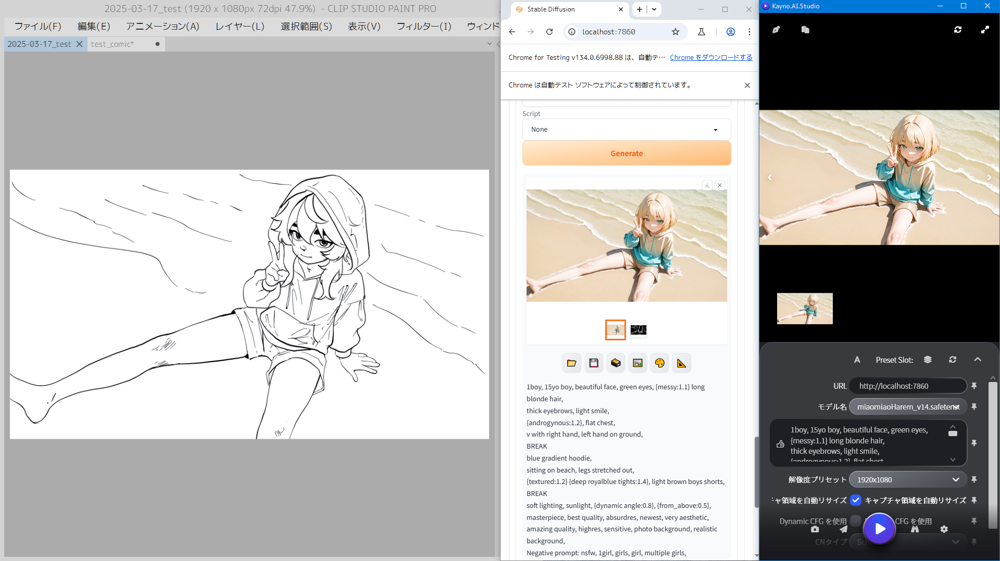

[Japanese](./README.md) | [en-US](./README.en-US.md) |

# What is Kayno.AI.Studio?

Kayno.AI.Studio is an AI application based on Stable Diffusion WebUI (SDWebUI), designed to be easy to use for everyone, from beginners to professional artists.

It allows for smooth image generation while maintaining compatibility with familiar software like Clip Studio Paint, Photoshop, and Blender.

### Features
- **Automatic image capture from the screen**
- **Save and restore presets and sessions** (Supports models, QuickSettings, and various extensions)
- **Simple and intuitive UI** (Includes an auto-installer and prompt assistance)

### Developer

| Developed by                                                                 | Contributor 1                   | Contributor 2 |
| ---------------------------------------------------------------------------- | ------------------------------- | ------------- |
|                     | -                               | -             |
| **Si**                                                                       | ChatGPT 4o                      | Cohere        |
| [🌏️](https://shota-injection.wew.jp/) [𝕏](https://x.com/Sh0taInjecti0n) [p](https://pixiv.net/users/1148458) ⚠ NSFW | [ChatGPT](https://chatgpt.com/) | [Cohere](https://cohereforai-c4ai-command.hf.space/)

**Contact Information**:
Please reach out via Pixiv, X (formerly Twitter) DMs, or Gmail.
Currently seeking job opportunities!
(Gmail address: shota.injection + domain)

**Original WebUI:**  
https://github.com/AUTOMATIC1111

 

## How to Use (Examples)

1. Launch Stable Diffusion WebUI using `webui-user.bat`
2. Start `Kayno.AI.Studio.exe`
3. Chrome will open automatically (**Do not close it while using Kayno**)
4. Draw a rough sketch based on a preset and send it

**・Generating from a sketch:**  
<video src="https://github.com/user-attachments/assets/f0ffb04b-7bb6-42af-baa7-0a2a81a9700c">

**・Manga panel layout:**  
~~[_res/readme/001.mp4]~~

**・Depth from Blender:**   
~~[_res/readme/001.mp4]~~  
※Work in progress...

### Detailed Usage:
For initial installation and other details, please refer to  
[ReadMe.Tutorial](./Kayno.AI.Studio/Documents/ReadMe.チュートリアル.md)

 

## Version
2025-03-19 Beta release

 

## Recommended Features

### 📷️ Seamless Workflow
**Automatic screen capture**

Kayno automatically captures illustrations on the screen for AI generation.
This allows rough sketches and ideas to be immediately reflected in AI generation.
Of course, you can also specify image files manually.

Recommended Use Cases:
- **Capture method** → Apply AI generation to specific characters or objects within a canvas
- **File specification method** → Generate AI images for the entire image

**Automatic img2img integration**

SD WebUI's img2img does not automatically update reference image files, but Kayno does this automatically, reducing manual effort.

**Automatic resolution adjustment**

Kayno can automatically adjust the resolution, eliminating the need to manually change settings for each image.  
(*Beta feature*)

**Distributed rendering**

"RTX 4090 or 5090 is too expensive, but I have two 3060s..."
Even in such situations, Kayno allows image generation across multiple PCs simultaneously.
It also makes reusing settings and managing backups easy.

 

### ⭐ Powerful and Flexible Data Management
**Supports Presets and Sessions**

Kayno allows saving and restoring presets and sessions, including QuickSettings and extensions.
Additionally, images used in img2img are saved individually, enabling easy switching between multiple inpaint and mask images.

**Easy and robust payload management**

We designed a binding UI where the configuration files and UI are fully integrated.

Features:
- Supports any extensions (*in theory*)
- Can be configured to work with any settings or web applications/pages
- Editable in an Excel-like tabular format instead of JSON

| -           | API-based Apps        | SDWebUI Extensions      | Kayno                                    |
| ----------- | ----------------- | ------------------- | --------------------------------------- |
| Method      | API               | Within WebUI        | Browser simulation  (Selenium)       |
| Extension Support | ⚠ Limited       | ⚠ Limited          | ✅️                                       |
| Management Format | JSON 😈 Complex | JSON, Unknown 😈 Complex | TSV (Tab-separated CSV) 😎 Excel-like & Easy |
| Setting Scope | ⭐.... Limited to API | ⭐⭐... Limited to scope | ⭐⭐⭐⭐. Fully linked to TSV, accessible via browser |
| Flexibility | ⭐.... Only implemented features | ⭐.... | ⭐⭐⭐⭐⭐ Enhanced via browser operations |

 

### 🔰 User-Friendly UI for Beginners and Professionals
**Intuitive UI and Setup**
Designed to be easy for beginners while providing the necessary features for professionals.

#### ✅️ **Beginner-friendly Starter Pack** *(Coming soon)*
- Automatic setup installer
- Parameter explanation tooltips on hover

#### ✅️ **Modern and Universal UI & Features**
- Pin frequently used settings
- Adjust weight with `Ctrl + ↓↑` (**Automatically recognizes surrounding keywords, no need to select manually**)
- PromptHelper to assist with prompts like hairstyles and compositions
- Touch-supported image gallery
- DPI-aware multi-monitor support *(probably)*
- Automatically fetches installed models

#### ✅️ **Advanced Yet Accessible Features for Professionals**
- Specify AI paths via `user.config`
- Supports NTFS directory junctions
  - Easily manage/store large models on different storage devices
  - Recommended over symbolic links, which do not work with SMB
- Customizable translations and tooltips
  - Enables teams to share settings and instructions

 

## FAQ
Refer to [this document](./Kayno.AI.Studio/Documents/ReadMe.FAQ.md).

 

## License
**Creative Commons BY**  
https://creativecommons.org/licenses/by/4.0/

Forking and modifying for redistribution is allowed under the **Creative Commons - BY** license.  
Simply crediting the author or application name is sufficient.

Example:
*Based on: Kayno.AI.Studio, by Si*

#### Regarding UI
UI-related files in the `DesignTemplates` directory are also freely distributable and modifiable under the CC-BY license.

**Falsely claiming to be the original author is strictly prohibited.**  
**DO NOT BE A LIAR.**

---

This is a translated version of the README. Let me know if any refinements are needed!

